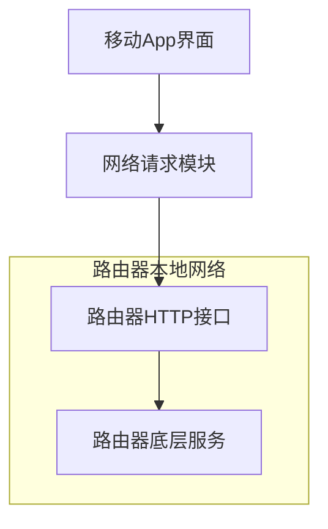

好的，根据您提供的详细接口信息和开发思路，我为您整理了一份专业的产品需求文档。

```markdown
# 产品需求文档 (PRD)

**产品名称**: NetControl Hub  
**版本**: V1.0  
**文档状态**: 初稿  
**创建日期**: 2026-06-21

---

## 1. 产品概述

### 1.1 项目背景与目标
目前，要对家庭/办公室网络中的特定设备进行限速或上网时间控制，需要手动登录路由器Web管理后台进行复杂操作，过程繁琐且专业门槛高。本项目旨在开发一款移动端App，通过模拟HTTP请求与路由器底层API交互，提供一套简洁、直观的界面，让用户可以随时随地快速查看并管理网络内所有设备的速度和上网时间权限。

### 1.2 核心价值主张
- **极简管理**：一键限速、一键断网，告别复杂的后台配置。
- **设备可视化**：清晰列出所有连接设备，智能识别设备类型与品牌。
- **时间管理**：支持预设上网时段模板，轻松管控孩子的上网时间。

### 1.3 适用范围
本阶段产品基于提供的TP-LINK路由器接口规范进行逆向开发，主要适配型号/固件版本与接口定义一致的路由器。

---

## 2. 用户角色

- **家庭网络管理员**：通常是家庭成员中的技术使用者，负责管理家庭网络，防止个别设备占用过高带宽，或控制儿童设备的上网时间。
- **小微企业办公室管理员**：管理办公网络，为访客网络限速，保障核心业务带宽。

---

## 3. 产品架构与技术方案

### 3.1 整体架构
App采用 **原生移动端 + 路由器本地API** 架构。



### 3.2 接口逆向与模拟法
本产品不依赖第三方云服务或路由器官方SDK，直接调用路由器Web管理后台的真实接口。

1.  **认证机制**：使用固定的管理员账号/密码通过POST请求获取动态Token (`stok`)。
2.  **请求格式**：
    -   **URL**: `http://192.168.2.1/stok=动态stok`
    -   **方法**: POST
    -   **请求体**: JSON格式，包含`method`（`do`或`get`）以及对应的`hosts_info`等业务参数。
3.  **Token生命周期管理**：App需在登录成功后缓存`stok`，并在每次请求时动态拼接URL。若Token失效（如路由器重启），需引导用户重新登录。

---

## 4. 功能需求详述

### 4.1 登录模块

#### 4.1.1 功能描述
用户输入路由器管理员密码，完成身份认证并获取操作凭证。

#### 4.1.2 接口逆向
-   **请求**:
    -   URL: `http://192.168.2.1`
    -   请求体参数：
        ```json
        {
          "method": "do",
          "login": {
            "username": "admin",
            "password": "[用户输入的密码]"
          }
        }
        ```
-   **响应处理**:
    -   成功：`error_code`为0时，从JSON中提取`stok`字段值，如`"tZfI%5D6eLGh8*P%3EEc(0X5SLmA3rDso(kA/ds"`，并安全存储在本地。
    -   失败：解析`error_code`并向用户提示“密码错误”或“连接失败”。

#### 4.1.3 界面要求
-   **密码输入框**：带掩码的输入框，支持显示/隐藏密码。
-   **记住密码**：提供复选框，可将密码加密后存储在本地钥匙串/KeyStore中。
-   **错误提示**：清晰地展示网络无法连接、密码错误等不同异常状态。

### 4.2 网络设备概览

#### 4.2.1 功能描述
获取并展示当前连接到路由器的所有设备列表，包括在线设备和离线但已绑定的设备。

#### 4.2.2 接口逆向
-   **请求**:
    -   URL: `http://192.168.2.1/stok=动态stok`
    -   请求体参数：
        ```json
        {
          "hosts_info": { "table": "host_info", "name": "cap_host_num" },
          "network": { "name": "iface_mac" },
          "hyfi": { "table": ["connected_ext"] },
          "custom_network": { "table": ["mac_filter_black_entry", "mac_filter_white_entry"] },
          "method": "get"
        }
        ```
-   **响应处理**:
    -   解析`hosts_info.host_info`数组，提取每个设备的`hostname`, `mac`, `ip`, `up_speed`, `down_speed`, `up_limit`, `down_limit`, `blocked`等信息。
    -   **数据清洗**：对URL编码的`hostname`（如`DESKTOP%2D7NC8I3N`）进行解码显示（`DESKTOP-7NC8I3N`）。
    -   **实时速率**：`up_speed`和`down_speed`单位应为KB/s，App需根据实际返回数值进行单位换算与展示。

#### 4.2.3 界面要求
-   **列表视图**：每项显示设备名称、MAC地址、实时上传/下载速率图。
-   **状态标识**：通过图标区分有线连接、2.4G Wi-Fi、5G Wi-Fi（根据`wifi_mode`, `phy_mode`字段）。
-   **下拉刷新**：手动触发重新获取设备列表。

### 4.3 设备限速控制

#### 4.3.1 功能描述
对指定设备设置上传/下载带宽上限，实现精细化流量控制。

#### 4.3.2 接口逆向
-   **请求**:
    -   URL: `http://192.168.2.1/stok=动态stok`
    -   请求体参数：
        ```json
        {
          "hosts_info": {
            "set_flux_limit": {
              "mac": "目标设备MAC",
              "is_blocked": "0",
              "name": "目标设备名称",
              "down_limit": "用户设置的下行限制，0为不限速，单位KB/s",
              "up_limit": "用户设置的上行限制，0为不限速，单位KB/s",
              "limit_time": "",
              "forbid_domain": ""
            }
          },
          "method": "do"
        }
        ```
-   **响应处理**:
    -   成功则`error_code`为0，界面返回成功提示。

#### 4.3.3 界面要求
-   **设置入口**：从设备详情页进入。
-   **滑块或输入框**：分别设置上传限速和下载限速，单位为KB/s。提供一个“不限速”的快捷开关（将值设为0）。
-   **当前限速值显示**：在设备列表中，被限速的设备应有特殊标记，并显示出限速值（`up_limit`, `down_limit`）。

### 4.4 上网时间限制

#### 4.4.1 功能描述
基于预设的时间段模板，控制指定设备能否上网。例如，将孩子手机的上网时段设置为“晚间剧场”。

#### 4.4.2 时间模板获取接口
-   **请求**:
    -   URL: `http://192.168.2.1/stok=动态stok`
    -   请求体参数：
        ```json
        {
          "hosts_info": { "table": "limit_time" },
          "method": "get"
        }
        ```
-   **响应处理**:
    -   解析`hosts_info.limit_time`数组，提取每个模板的`name`（需URL解码）和唯一标识（如`limit_time_2`）。
    -   模板`name`示例解码对照：`%E5%8D%88%E5%A4%9C%E5%89%A7%E5%9C%BA` -> `午夜剧场`。

#### 4.4.3 时间限制设置接口
-   **请求**:
    -   URL: `http://192.168.2.1/stok=动态stok`
    -   请求体参数：
        ```json
        {
          "hosts_info": {
            "set_host_info": {
              "mac": "目标设备MAC",
              "is_blocked": "0",
              "name": "目标设备名称",
              "down_limit": "0",
              "up_limit": "0",
              "forbid_domain": "",
              "limit_time": "所选模板的标识，如limit_time_2"
            }
          },
          "method": "do"
        }
        ```
-   **响应处理**:
    -   成功则`error_code`为0。

#### 4.4.4 界面要求
-   **操作入口**：设备详情页中，点击“上网时间限制”。
-   **模板选择器**：以列表形式加载所有从路由器获取的时间模板，显示其名称、生效日期（星期一至日）和时间段。
-   **状态反馈**：选择模板后，明确提示用户“该设备上网时间将受[模板名称]限制”。
-   **取消限制**：提供一个“不受限制”的选项，传参时`limit_time`为空字符串。

---

## 5. 数据与异常处理

### 5.1 数据模型

**设备模型 (Device)**
| 字段 | 类型 | 来源字段 | 说明 |
| :--- | :--- | :--- | :--- |
| mac | String | `mac` | 主键，设备唯一标识 |
| ip | String | `ip` | IP地址 |
| name | String | `hostname` (URL解码) | 设备名称 |
| isOnline | Bool | `up_speed`, `down_speed` | 根据是否有速率或最后通信时间判断 |
| upSpeed | Int | `up_speed` | 实时上传速率 |
| downSpeed | Int | `down_speed` | 实时下载速率 |
| downLimit | Int | `down_limit` | 当前下行限制 |
| upLimit | Int | `up_limit` | 当前上行限制 |
| limitTimeId | String | `limit_time` | 当前绑定的上网时间模板ID |

### 5.2 异常与边界处理
-   **Token失效**：任何接口返回`error_code: -1`或类似身份认证错误时，自动跳转至登录页面。
-   **重复登录**：登录请求发送时，禁用登录按钮，避免生成多个无效Token。
-   **网络超时**：设置请求超时时间（如5秒），超时后提示用户“路由器响应超时，请检查网络”。
-   **MAC地址格式**：在发送请求前，需将界面显示的MAC格式（`44-85-00-b1-4c-2a`）转换为路由器可识别的大小写格式，确保一致性。
-   **空数据**：获取设备列表为空时，展示“当前无设备连接”的占位图。

---

## 6. 非功能需求

-   **性能**: App启动到显示设备列表的总时长不超过2秒（受限于路由器API响应速度）。
-   **安全性**:
    -   `stok`和用户密码必须使用平台级安全存储（iOS Keychain, Android KeyStore）。
    -   所有请求均在局域网内通过HTTP明文传输，需在App首次使用指引中明确告知用户此安全风险，并建议仅在可信私有网络中使用。
-   **兼容性**:
    -   支持iOS 14+及Android 10+。
    -   优先保障对接口示例中路由器版本（TP-LINK WTA302_0693等）的完美兼容。

---

## 7. 项目里程碑 (V1.0)

-   **Week 1**: 完成工程搭建，实现路由器登录、Token管理及基本网络请求框架。
-   **Week 2**: 完成设备列表页UI开发，对接设备获取接口，实现数据解析与展示。
-   **Week 3**: 完成设备限速设置、上网时间模板获取与设置功能的UI及接口对接。
-   **Week 4**: 全功能回归测试、异常流程处理、UI细节打磨，提交应用商店审核。
```